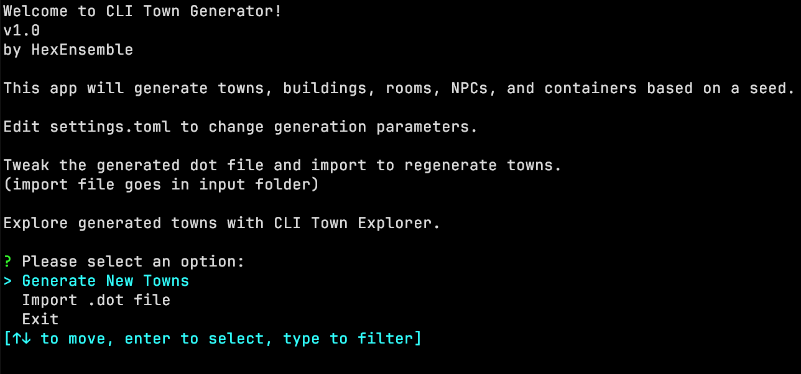

# CLI Town Generator

Procedural town generation tool, built with Rust. 🏰

Towns can be explored using my [Town Explorer](https://github.com/hexensemble/cli-town-explorer).

 

 

- Randomly generates towns with buildings, rooms, NPCs, chests, and more.
- Exports world data as a JSON file and town connections as a DOT file.
- Configurable via a settings file for customization.
- Supports importing a modified DOT file to regenerate town data.
