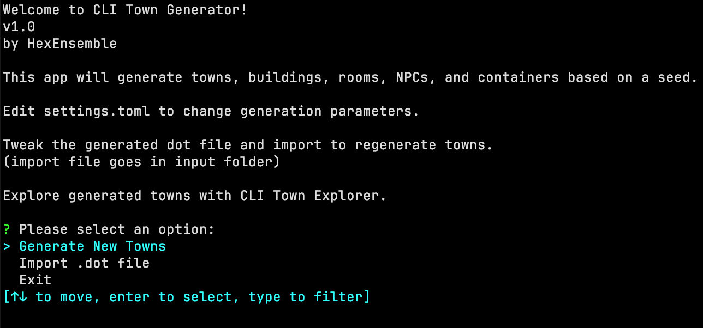

# CLI Town Generator

Procedural town generation tool, built with Rust. 🏰

 

This CLI tool will randomly generate text-based lists of towns, including buildings, which in turn contain rooms, NPCs, chests etc. You can then export the world data as a JSON file and the town connections (AKA roads) as a DOT file.

Generated towns can be "explored" using my [CLI Town Explorer](https://github.com/hexensemble/cli-town-explorer).

Everything is configurable via `settings.toml` for customization.

You can even manually edit a generated DOT file then reimport it to generate the corresponding town data.

 

 

**Download:** https://github.com/hexensemble/cli-town-generator/releases

 

Supports Mac and Linux.
